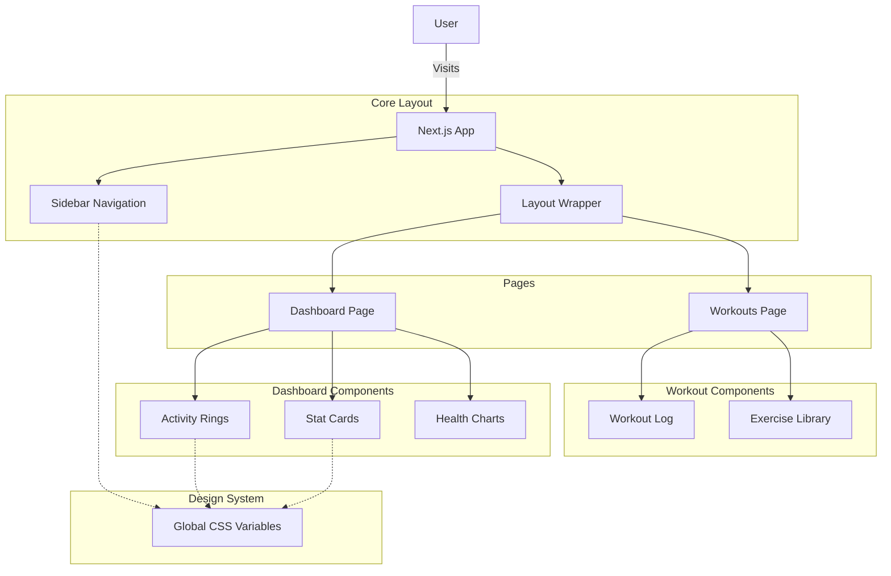

# Premium Fitness Tracker

A premium, high-performance fitness tracking application built with **Next.js** and **Vanilla CSS**. This project features a visually stunning, glassmorphic dark theme, interactive activity rings, and a comprehensive workout logging system designed to provide users with a delightful and motivating experience.

## ✨ Features

- **Dynamic Dashboard**: 
  - **Activity Rings**: SVG-based animated progress rings for daily goals (Move, Exercise, Stand).
  - **Daily Stats**: Interactive cards displaying Steps, Heart Rate, Water Intake, and Sleep.
  - **Health Metrics**: Visual charts tracking weekly activity trends.
- **Workout Tracking**:
  - **Exercise Library**: Curated list of exercises with muscle group tags.
  - **Activity History**: Detailed log of recent workouts with duration and calorie stats.
- **Premium UX/UI**:
  - **Dark Mode**: Deep, elegant color palette with vibrant gradients.
  - **Glassmorphism**: Translucent panels and blurs for a modern aesthetic.
  - **Micro-animations**: Smooth entrance animations and hover effects.
  - **Responsive Design**: Flawless experience across mobile, tablet, and desktop.

## 🛠 Tech Stack

- **Framework**: [Next.js 15 (App Router)](https://nextjs.org/)
- **Language**: [TypeScript](https://www.typescriptlang.org/)
- **Styling**: Vanilla CSS (CSS Modules & Variables)
- **Icons**: [Lucide React](https://lucide.dev/)
- **Fonts**: [Outfit](https://fonts.google.com/specimen/Outfit) (via `next/font`)

## 🏗 Architecture

The application follows a component-based architecture optimized for performance and maintainability.



## 🚀 Getting Started

1. **Clone the repository:**
   ```bash
   git clone git@github.com:PriyankaSDaida/premium-fitness-tracker.git
   cd premium-fitness-tracker
   ```

2. **Install dependencies:**
   ```bash
   npm install
   ```

3. **Run the development server:**
   ```bash
   npm run dev
   ```

4. **Open your browser:**
   Navigate to [http://localhost:3000](http://localhost:3000) to view the application.

## 📄 License

This project is open source and available under the [MIT License](LICENSE).
