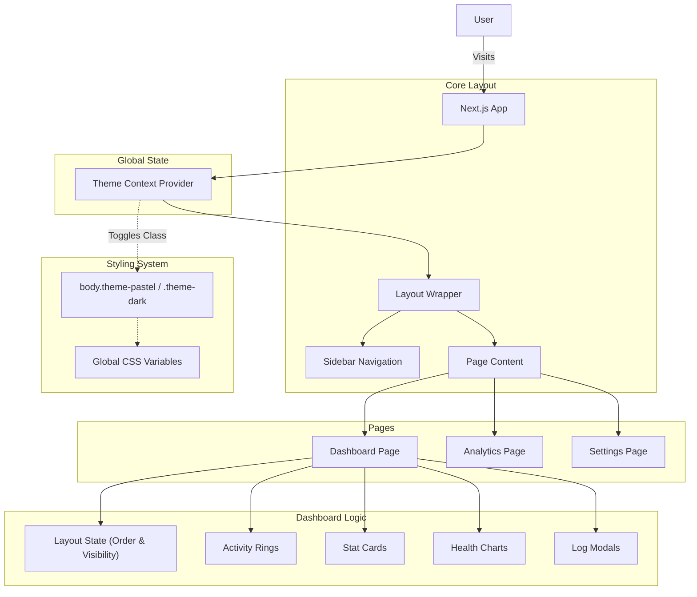

# Premium Fitness Tracker

A premium, high-performance fitness tracking application built with **Next.js** and **Vanilla CSS**. This project features a visually stunning interface with dual theme support (Dark/Pastel), interactive Dashboard customization, and a comprehensive workout logging system.


## ✨ Features

- **Personalized Dashboard Experience**: 
  - **Drag & Drop Reordering**: Completely customize your dashboard layout by dragging widgets to your preferred order.
  - **Visibility Toggles**: Hide specific widgets (like Activity Rings or Charts) to focus on what matters most to you.
  - **Activity Rings**: SVG-based animated progress rings for daily goals (Move, Exercise, Stand).
  - **Daily Stats**: Interactive cards displaying Steps, Heart Rate, Water Intake, and Sleep.
  
- **Dual Theme System**:
  - **Pastel Mode (New)**: A soothing, light theme with warm cream backgrounds and soft accents (Violet, Mint, Pink).
  - **Premium Dark Mode**: Deep, elegant dark theme with vibrant neon gradients.
  - **Persistence**: User theme preference is saved and automatically applied on next visit.

- **Navigation & Pages**:
  - **Analytics**: A dedicated page for deeper health insights (coming soon).
  - **Settings**: Manage your profile and app preferences, including the Theme Switcher.
  - **Working Sidebar**: Fully functional navigation links with active state highlighting.

- **Workout Tracking**:
  - **Quick Actions**: Log workouts, water, and sleep directly from the 
  - **Activity History**: View logs of recent activities.

## 🛠 Tech Stack

- **Framework**: [Next.js 15 (App Router)](https://nextjs.org/)
- **Language**: [TypeScript](https://www.typescriptlang.org/)
- **State Management**: React Context (Theme), Local State (Dashboard)
- **Styling**: Vanilla CSS (CSS Modules & Variables)
- **Icons**: [Lucide React](https://lucide.dev/)
- **Fonts**: [Outfit](https://fonts.google.com/specimen/Outfit) (via `next/font`)

## 🏗 Architecture

The application follows a modular, component-based architecture powered by React Context for global state management.



### 🧩 Architecture Overview

The **Premium Fitness Tracker** leverages the **Next.js 15 App Router** for performance and SEO.

-   **Global Theme Management**: A `ThemeContext` provider wraps the entire application, managing the user's preferred theme (Dark vs. Pastel) and persisting it to `localStorage`. It dynamically updates the `body` class, enabling CSS variables to cascade changes instantly across the app.
-   **Dashboard Container**: The `Dashboard` page is a "smart" container that manages:
    -   **Widget Visibility**: State to track which sections are shown/hidden.
    -   **Layout Order**: An array state tracking the sequence of widgets, manipulated via the HTML5 Drag and Drop API.
-   **Component Design**:
    -   **Atomic Components**: Small, reusable UI elements (e.g., `ActivityRing`, `StatCard`) are built to be stateless and presentational.
    -   **Section Wrappers**: A specialized wrapper component handles the specific drag-and-drop events and visibility styles for each dashboard widget.

## 🚀 Getting Started

1. **Clone the repository:**
   ```bash
   git clone git@github.com:PriyankaSDaida/premium-fitness-tracker.git
   cd premium-fitness-tracker
   ```

2. **Install dependencies:**
   ```bash
   npm install
   ```

3. **Run the development server:**
   ```bash
   npm run dev
   ```

4. **Open your browser:**
   Navigate to [http://localhost:3000](http://localhost:3000) to view the application.

## 🤝 Contributing

Contributions are welcome! Please feel free to submit a Pull Request.

1. Fork the project
2. Create your feature branch (`git checkout -b feature/AmazingFeature`)
3. Commit your changes (`git commit -m 'Add some AmazingFeature'`)
4. Push to the branch (`git push origin feature/AmazingFeature`)
5. Open a Pull Request

## 🔮 Future Enhancements

- **Backend Integration**: Implement **Supabase** or **PostgreSQL** with Prisma to persist user data, workout logs, and settings.
- **Authentication**: Add secure user sessions using **Clerk** or **NextAuth.js**.
- **Wearable Sync**: Integration with **Apple HealthKit** and **Google Fit** APIs.
- **Advanced Visualization**: Interactive graphs using **Recharts** to analyze long-term health trends.
- **Widget Library**: A modal to add new widgets (Hydration, Sleep, Calories) dynamically.

## 📄 License

This project is open source and available under the [MIT License](LICENSE).
